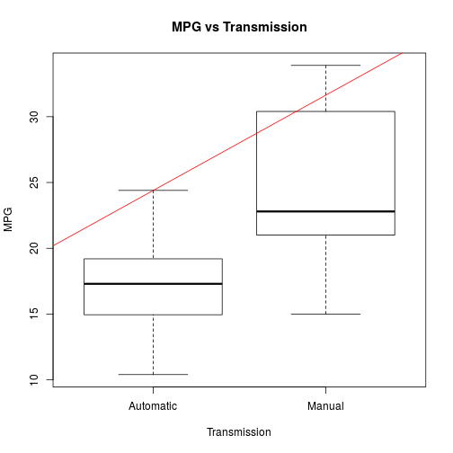
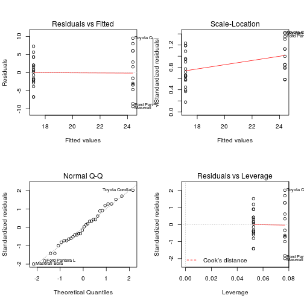
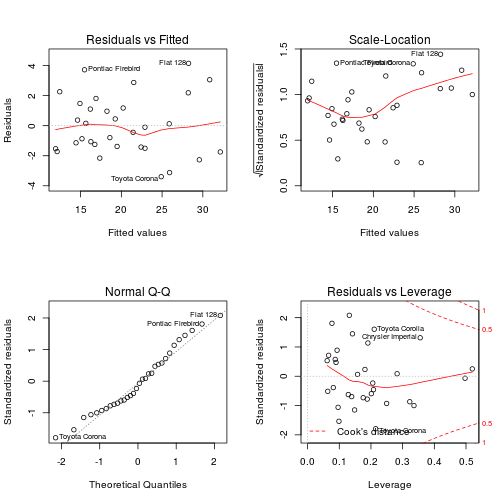

## Deployed App

### Part0: Regression Models Course Project  
- URL: *https://github.com/mandelbrot/coursera-devdataprod-004/blob/master/shiny/www/regmods.html*
- Difference of the MPG between automatic and manual transmissions is focused in Part0.

### Part1: Shiny Application  
- URL: *http://mandelbrot.shinyapps.io/shiny/*
- A shiny-App shows the relationship between variables and miles per gallon (MPG).

### Part2: Reproducible Pitch Presentation  
- URL: *https://github.com/mandelbrot/coursera-devdataprod-004/tree/master/slidify*

### Get all SourceCode @Github:

```
git clone https://github.com/mandelbrot/coursera-devdataprod-004.git
```

## mtcars dataset - Description

### Motor Trend Car Road Tests

> The data was extracted from the 1974 Motor Trend US magazine, and comprises fuel consumption and 10 aspects of automobile design and performance for 32 automobiles (1973–74 models).

### Source
> Henderson and Velleman (1981), Building multiple regression models interactively. Biometrics, 37, 391–411.


```r
library(datasets)
head(mtcars, 3)
```

```
##                mpg cyl disp  hp drat    wt  qsec vs am gear carb
## Mazda RX4     21.0   6  160 110 3.90 2.620 16.46  0  1    4    4
## Mazda RX4 Wag 21.0   6  160 110 3.90 2.875 17.02  0  1    4    4
## Datsun 710    22.8   4  108  93 3.85 2.320 18.61  1  1    4    1
```

---

## mtcars dataset - Format

**A data frame with 32 observations on 11 variables.**

| Index | Field | Detail |
------- | ----- | ------ |
| [, 1] | mpg | Miles/(US) gallon |
| [, 2]  | cyl | Number of cylinders |
| [, 3]  | disp | Displacement (cu.in.) |
| [, 4]  | hp | Gross horsepower |
| [, 5]	| drat | Rear axle ratio |
| [, 6]	| wt | Weight (lb/1000) |
| [, 7]	| qsec | 1/4 mile time |
| [, 8]	| vs | V/S |
| [, 9]	| am | Transmission (0 = automatic, 1 = manual) |
| [,10]	| gear | Number of forward gears |
| [,11]	| carb | Number of carburetors |

---

## Analysis - main code

See the boxplot as fig 1 for visual explanation.

```r
fit1 <- lm(mpg~am, data=mtcars)
summary(fit1)
```

```
## 
## Call:
## lm(formula = mpg ~ am, data = mtcars)
## 
## Residuals:
##    Min     1Q Median     3Q    Max 
## -9.392 -3.092 -0.297  3.244  9.508 
## 
## Coefficients:
##             Estimate Std. Error t value Pr(>|t|)    
## (Intercept)    17.15       1.12   15.25  1.1e-15 ***
## am              7.24       1.76    4.11  0.00029 ***
## ---
## Signif. codes:  0 '***' 0.001 '**' 0.01 '*' 0.05 '.' 0.1 ' ' 1
## 
## Residual standard error: 4.9 on 30 degrees of freedom
## Multiple R-squared:  0.36,	Adjusted R-squared:  0.338 
## F-statistic: 16.9 on 1 and 30 DF,  p-value: 0.000285
```

### Finding the best model

Let's fit a model with all explanatory variables. R-squared = 0.869

```r
fitAll<-lm(mpg~.,mtcars)
summary(fitAll)
```

```
## 
## Call:
## lm(formula = mpg ~ ., data = mtcars)
## 
## Residuals:
##    Min     1Q Median     3Q    Max 
##  -3.45  -1.60  -0.12   1.22   4.63 
## 
## Coefficients:
##             Estimate Std. Error t value Pr(>|t|)  
## (Intercept)  12.3034    18.7179    0.66    0.518  
## cyl          -0.1114     1.0450   -0.11    0.916  
## disp          0.0133     0.0179    0.75    0.463  
## hp           -0.0215     0.0218   -0.99    0.335  
## drat          0.7871     1.6354    0.48    0.635  
## wt           -3.7153     1.8944   -1.96    0.063 .
## qsec          0.8210     0.7308    1.12    0.274  
## vs            0.3178     2.1045    0.15    0.881  
## am            2.5202     2.0567    1.23    0.234  
## gear          0.6554     1.4933    0.44    0.665  
## carb         -0.1994     0.8288   -0.24    0.812  
## ---
## Signif. codes:  0 '***' 0.001 '**' 0.01 '*' 0.05 '.' 0.1 ' ' 1
## 
## Residual standard error: 2.65 on 21 degrees of freedom
## Multiple R-squared:  0.869,	Adjusted R-squared:  0.807 
## F-statistic: 13.9 on 10 and 21 DF,  p-value: 3.79e-07
```

P values are high so we can use only those variables with low p values, for example p, wt, qsec and am. Actually, we got 0.8579 R-squared for model lm(mpg~hp+wt+qsec+am,mtcars) which is lower than fitAll model, but with a little experimenting, I got the following model with 0.8942 R-squared:

```r
fit2<-lm(mpg~hp*wt+qsec+am,mtcars)
summary(fit2)
```

```
## 
## Call:
## lm(formula = mpg ~ hp * wt + qsec + am, data = mtcars)
## 
## Residuals:
##    Min     1Q Median     3Q    Max 
## -3.394 -1.441 -0.271  1.253  4.150 
## 
## Coefficients:
##             Estimate Std. Error t value Pr(>|t|)    
## (Intercept) 35.93948   10.26506    3.50  0.00169 ** 
## hp          -0.09776    0.02954   -3.31  0.00274 ** 
## wt          -7.92300    1.75109   -4.52  0.00012 ***
## qsec         0.59727    0.39232    1.52  0.13998    
## am           0.91131    1.40071    0.65  0.52101    
## hp:wt        0.02516    0.00841    2.99  0.00602 ** 
## ---
## Signif. codes:  0 '***' 0.001 '**' 0.01 '*' 0.05 '.' 0.1 ' ' 1
## 
## Residual standard error: 2.14 on 26 degrees of freedom
## Multiple R-squared:  0.894,	Adjusted R-squared:  0.874 
## F-statistic:   44 on 5 and 26 DF,  p-value: 7.18e-12
```

### Comparing models

We got 2 models, second one combining variables describes Mpg the best.

See fig 2 and 3 for visual explanation.

```r
anova(fit1, fit2)
```

```
## Analysis of Variance Table
## 
## Model 1: mpg ~ am
## Model 2: mpg ~ hp * wt + qsec + am
##   Res.Df RSS Df Sum of Sq    F  Pr(>F)    
## 1     30 721                              
## 2     26 119  4       602 32.8 8.1e-10 ***
## ---
## Signif. codes:  0 '***' 0.001 '**' 0.01 '*' 0.05 '.' 0.1 ' ' 1
```

P value is lower than 0.05 which means that model fit2 is significant improvement over model fit1

## Appendix

### Figure 1

```r
m<-transform(mtcars, am=factor(am))
levels(m$am)[1] <- "Automatic"
levels(m$am)[2] <- "Manual"
plot(m$am , m$mpg, main="MPG vs Transmission", xlab="Transmission", ylab="MPG", )
abline(lm(mpg ~ am, m), col="red")
```

 

### Figure 2

```r
layout(matrix(c(1,2,3,4),2,2))
plot(fit1)
```

 

### Figure 3

```r
layout(matrix(c(1,2,3,4),2,2))
plot(fit2)
```

 

